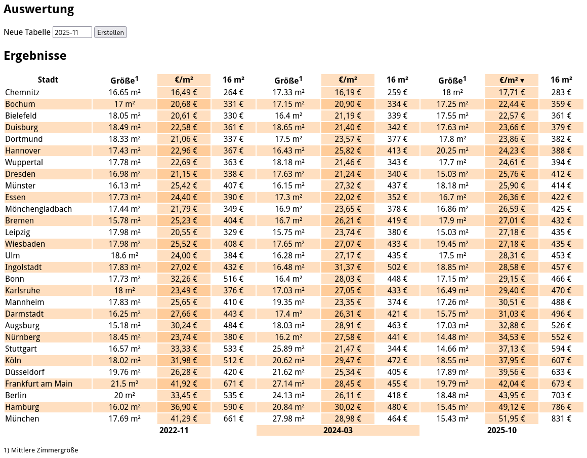

# WG-Zimmer_Statistik
Mittlere Kosten (warm) und Größen von WG-Zimmer in großen Deutschen Städten (von wg-gesucht.de). 
Filter: 2er-4er WGs, 100-1000 €, unbefristet

Tabelle ist sortierbar und per Knopfdruck erweiterbar. Daten müssen einzeln abgefragt werden, da es ein rate limiting gibt.

<table class="sortable">
<thead>
<tr>
	<th>Stadt</th>
	<th>Größe1</th>
	<th>€/m²</th>
	<th>16 m²</th>
	<th>Größe1</th>
	<th>€/m²</th>
	<th>16 m²</th>
	<th>Größe1</th>
	<th>€/m²</th>
	<th>16 m²</th>
</tr>
</thead>
<tbody>
<tr>
	<td style="white-space: nowrap;min-width: 170px;">Augsburg</td>
	<td>15.18 m²	</td>
	<td>30,24 €	</td>
	<td>484 €	</td>
	<td>18.03 m²	</td>
	<td>28,91 €	</td>
	<td>463 €	</td>
	<td>17.03 m²	</td>
	<td>32,88 €	</td>
	<td>526 €	</td>
</tr>
<tr>
	<td style="white-space: nowrap;min-width: 170px;">Berlin</td>
	<td>20 m²	</td>
	<td>33,45 €	</td>
	<td>535 €	</td>
	<td>24.13 m²	</td>
	<td>26,11 €	</td>
	<td>418 €	</td>
	<td>18.48 m²	</td>
	<td>43,95 €	</td>
	<td>703 €	</td>
</tr>
<tr>
	<td style="white-space: nowrap;min-width: 170px;">Bielefeld</td>
	<td>18.05 m²	</td>
	<td>20,61 €	</td>
	<td>330 €	</td>
	<td>16.4 m²	</td>
	<td>21,19 €	</td>
	<td>339 €	</td>
	<td>17.55 m²	</td>
	<td>22,57 €	</td>
	<td>361 €	</td>
</tr>
<tr>
	<td style="white-space: nowrap;min-width: 170px;">Bochum</td>
	<td>17 m²	</td>
	<td>20,68 €	</td>
	<td>331 €	</td>
	<td>17.15 m²	</td>
	<td>20,90 €	</td>
	<td>334 €	</td>
	<td>17.25 m²	</td>
	<td>22,44 €	</td>
	<td>359 €	</td>
</tr>
<tr>
	<td style="white-space: nowrap;min-width: 170px;">Bonn</td>
	<td>17.73 m²	</td>
	<td>32,26 €	</td>
	<td>516 €	</td>
	<td>16.4 m²	</td>
	<td>28,03 €	</td>
	<td>448 €	</td>
	<td>17.15 m²	</td>
	<td>29,15 €	</td>
	<td>466 €	</td>
</tr>
<tr>
	<td style="white-space: nowrap;min-width: 170px;">Bremen</td>
	<td>15.78 m²	</td>
	<td>25,23 €	</td>
	<td>404 €	</td>
	<td>16.7 m²	</td>
	<td>26,21 €	</td>
	<td>419 €	</td>
	<td>17.9 m²	</td>
	<td>27,01 €	</td>
	<td>432 €	</td>
</tr>
<tr>
	<td style="white-space: nowrap;min-width: 170px;">Chemnitz</td>
	<td>16.65 m²	</td>
	<td>16,49 €	</td>
	<td>264 €	</td>
	<td>17.33 m²	</td>
	<td>16,19 €	</td>
	<td>259 €	</td>
	<td>18 m²	</td>
	<td>17,71 €	</td>
	<td>283 €	</td>
</tr>
<tr>
	<td style="white-space: nowrap;min-width: 170px;">Darmstadt</td>
	<td>16.25 m²	</td>
	<td>27,66 €	</td>
	<td>443 €	</td>
	<td>17.4 m²	</td>
	<td>26,31 €	</td>
	<td>421 €	</td>
	<td>15.75 m²	</td>
	<td>31,03 €	</td>
	<td>496 €	</td>
</tr>
<tr>
	<td style="white-space: nowrap;min-width: 170px;">Dortmund</td>
	<td>18.33 m²	</td>
	<td>21,06 €	</td>
	<td>337 €	</td>
	<td>17.5 m²	</td>
	<td>23,57 €	</td>
	<td>377 €	</td>
	<td>17.8 m²	</td>
	<td>23,86 €	</td>
	<td>382 €	</td>
</tr>
<tr>
	<td style="white-space: nowrap;min-width: 170px;">Dresden</td>
	<td>16.98 m²	</td>
	<td>21,15 €	</td>
	<td>338 €	</td>
	<td>17.63 m²	</td>
	<td>21,24 €	</td>
	<td>340 €	</td>
	<td>15.03 m²	</td>
	<td>25,76 €	</td>
	<td>412 €	</td>
</tr>
<tr>
	<td style="white-space: nowrap;min-width: 170px;">Duisburg</td>
	<td>18.49 m²	</td>
	<td>22,58 €	</td>
	<td>361 €	</td>
	<td>18.65 m²	</td>
	<td>21,40 €	</td>
	<td>342 €	</td>
	<td>17.63 m²	</td>
	<td>23,66 €	</td>
	<td>379 €	</td>
</tr>
<tr>
	<td style="white-space: nowrap;min-width: 170px;">Düsseldorf</td>
	<td>19.76 m²	</td>
	<td>26,28 €	</td>
	<td>420 €	</td>
	<td>21.62 m²	</td>
	<td>25,34 €	</td>
	<td>405 €	</td>
	<td>17.89 m²	</td>
	<td>39,56 €	</td>
	<td>633 €	</td>
</tr>
<tr>
	<td style="white-space: nowrap;min-width: 170px;">Essen</td>
	<td>17.73 m²	</td>
	<td>24,40 €	</td>
	<td>390 €	</td>
	<td>17.3 m²	</td>
	<td>22,02 €	</td>
	<td>352 €	</td>
	<td>16.7 m²	</td>
	<td>26,36 €	</td>
	<td>422 €	</td>
</tr>
<tr>
	<td style="white-space: nowrap;min-width: 170px;">Frankfurt am Main</td>
	<td>21.5 m²	</td>
	<td>41,92 €	</td>
	<td>671 €	</td>
	<td>27.14 m²	</td>
	<td>28,45 €	</td>
	<td>455 €	</td>
	<td>19.79 m²	</td>
	<td>42,04 €	</td>
	<td>673 €	</td>
</tr>
<tr>
	<td style="white-space: nowrap;min-width: 170px;">Hamburg</td>
	<td>16.02 m²	</td>
	<td>36,90 €	</td>
	<td>590 €	</td>
	<td>20.84 m²	</td>
	<td>30,02 €	</td>
	<td>480 €	</td>
	<td>15.45 m²	</td>
	<td>49,12 €	</td>
	<td>786 €	</td>
</tr>
<tr>
	<td style="white-space: nowrap;min-width: 170px;">Hannover</td>
	<td>17.43 m²	</td>
	<td>22,96 €	</td>
	<td>367 €	</td>
	<td>16.43 m²	</td>
	<td>25,82 €	</td>
	<td>413 €	</td>
	<td>20.25 m²	</td>
	<td>24,23 €	</td>
	<td>388 €	</td>
</tr>
<tr>
	<td style="white-space: nowrap;min-width: 170px;">Ingolstadt</td>
	<td>17.83 m²	</td>
	<td>27,02 €	</td>
	<td>432 €	</td>
	<td>16.48 m²	</td>
	<td>31,37 €	</td>
	<td>502 €	</td>
	<td>18.85 m²	</td>
	<td>28,58 €	</td>
	<td>457 €	</td>
</tr>
<tr>
	<td style="white-space: nowrap;min-width: 170px;">Karlsruhe</td>
	<td>18 m²	</td>
	<td>23,49 €	</td>
	<td>376 €	</td>
	<td>17.03 m²	</td>
	<td>27,05 €	</td>
	<td>433 €	</td>
	<td>16.49 m²	</td>
	<td>29,40 €	</td>
	<td>470 €	</td>
</tr>
<tr>
	<td style="white-space: nowrap;min-width: 170px;">Köln</td>
	<td>18.02 m²	</td>
	<td>31,98 €	</td>
	<td>512 €	</td>
	<td>20.62 m²	</td>
	<td>29,47 €	</td>
	<td>472 €	</td>
	<td>18.55 m²	</td>
	<td>37,95 €	</td>
	<td>607 €	</td>
</tr>
<tr>
	<td style="white-space: nowrap;min-width: 170px;">Leipzig</td>
	<td>17.98 m²	</td>
	<td>20,55 €	</td>
	<td>329 €	</td>
	<td>15.75 m²	</td>
	<td>23,74 €	</td>
	<td>380 €	</td>
	<td>15.03 m²	</td>
	<td>27,18 €	</td>
	<td>435 €	</td>
</tr>
<tr>
	<td style="white-space: nowrap;min-width: 170px;">Mannheim</td>
	<td>17.83 m²	</td>
	<td>25,65 €	</td>
	<td>410 €	</td>
	<td>19.35 m²	</td>
	<td>23,35 €	</td>
	<td>374 €	</td>
	<td>17.26 m²	</td>
	<td>30,51 €	</td>
	<td>488 €	</td>
</tr>
<tr>
	<td style="white-space: nowrap;min-width: 170px;">Mönchengladbach</td>
	<td>17.44 m²	</td>
	<td>21,79 €	</td>
	<td>349 €	</td>
	<td>16.9 m²	</td>
	<td>23,65 €	</td>
	<td>378 €	</td>
	<td>16.86 m²	</td>
	<td>26,59 €	</td>
	<td>425 €	</td>
</tr>
<tr>
	<td style="white-space: nowrap;min-width: 170px;">München</td>
	<td>17.69 m²	</td>
	<td>41,29 €	</td>
	<td>661 €	</td>
	<td>27.98 m²	</td>
	<td>28,98 €	</td>
	<td>464 €	</td>
	<td>15.43 m²	</td>
	<td>51,95 €	</td>
	<td>831 €	</td>
</tr>
<tr>
	<td style="white-space: nowrap;min-width: 170px;">Münster</td>
	<td>16.13 m²	</td>
	<td>25,42 €	</td>
	<td>407 €	</td>
	<td>16.15 m²	</td>
	<td>27,32 €	</td>
	<td>437 €	</td>
	<td>18.18 m²	</td>
	<td>25,90 €	</td>
	<td>414 €	</td>
</tr>
<tr>
	<td style="white-space: nowrap;min-width: 170px;">Nürnberg</td>
	<td>18.45 m²	</td>
	<td>23,74 €	</td>
	<td>380 €	</td>
	<td>16.2 m²	</td>
	<td>27,58 €	</td>
	<td>441 €	</td>
	<td>14.48 m²	</td>
	<td>34,53 €	</td>
	<td>552 €	</td>
</tr>
<tr>
	<td style="white-space: nowrap;min-width: 170px;">Stuttgart</td>
	<td>16.57 m²	</td>
	<td>33,33 €	</td>
	<td>533 €	</td>
	<td>25.89 m²	</td>
	<td>21,47 €	</td>
	<td>344 €	</td>
	<td>14.66 m²	</td>
	<td>37,13 €	</td>
	<td>594 €	</td>
</tr>
<tr>
	<td style="white-space: nowrap;min-width: 170px;">Ulm</td>
	<td>18.6 m²	</td>
	<td>24,00 €	</td>
	<td>384 €	</td>
	<td>16.28 m²	</td>
	<td>27,17 €	</td>
	<td>435 €	</td>
	<td>17.5 m²	</td>
	<td>28,31 €	</td>
	<td>453 €	</td>
</tr>
<tr>
	<td style="white-space: nowrap;min-width: 170px;">Wiesbaden</td>
	<td>17.98 m²	</td>
	<td>25,52 €	</td>
	<td>408 €	</td>
	<td>17.65 m²	</td>
	<td>27,07 €	</td>
	<td>433 €	</td>
	<td>19.45 m²	</td>
	<td>27,18 €	</td>
	<td>435 €	</td>
</tr>
<tr>
	<td style="white-space: nowrap;min-width: 170px;">Wuppertal</td>
	<td>17.78 m²	</td>
	<td>22,69 €	</td>
	<td>363 €	</td>
	<td>18.18 m²	</td>
	<td>21,46 €	</td>
	<td>343 €	</td>
	<td>17.7 m²	</td>
	<td>24,61 €	</td>
	<td>394 €	</td>
</tr>
<tfoot>
<tr>
	<th></th>
	<th colspan="3" style="min-width: 320px;">2022-11</th>
	<th colspan="3" style="min-width: 320px;">2024-03</th>
	<th colspan="3" style="min-width: 320px;">2025-10</th>
</tr>
</tfoot>
</table>

<small>1\) Mittlere Zimmergröße</small>
